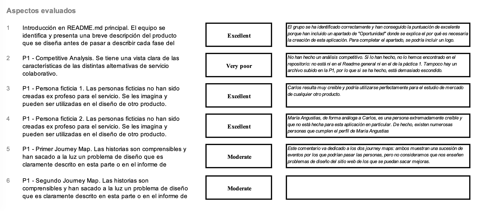

# DIU - Practica 4, entregables

## Caso 1

Descripcion y hoja de valoración.    

## Caso 2

Descripcion y hoja de valoración.  

## Caso 3: DIU3.BNET - EventWORLD

> El enlace al repositorio del caso 3: https://github.com/alejandrobonet/DIU20

> La hoja de valoración de este grupo se encuentra en el siguiente enlace (en formato pdf): https://github.com/NaroaAlonso/DIU20/blob/master/P4/Entregables/DIU3%7BBNET%7DCaseStudy-review_Mayko.pdf

El grupo DIU3.BNET (enlace: https://github.com/alejandrobonet/DIU20) ha realizado la aplicación EventWORLD, para crear una comunidad donde los usuarios puedan encontrar actividades tanto para deshacerse de la rutina cerca de casa como para vivir aventuras en viajes.

La valoración se ha hecho sobre los siguientes componentes del desarrollo del producto:

-----

-----

-----

La puntuación total de este caso ha sido de 68, lo que da un resultado de "Justo, pero no brillante"; aunque se encuentra en este nivel por un único punto, por lo que podemos afirmar que este proceso de desarrollo es "Bueno, se ha hecho con correctitud". 

#### Puntos fuertes

- El punto fuerte del proceso ha sido la historia en vídeo, donde se ha explicado todo muy detalladamente y de forma concisa todo el proceso de desarrollo. 

- Los bocetos resultan fáciles de leer e incluyen bastante información, lo que nos da una visión muy aproximada de cómo será la aplicación y nos ofrece la posibilidad de realizar un User Testing más adecuado.

- Las guidelines y son muy extensas y detalladas, y la arquitectura del sitio se ha hecho de una forma muy clara; lo que ayudará en gran medida a la implementación de la aplicación.

#### Puntos débiles

- La disposición de la información en el repositorio es incoherente, ya que en el readme principal del repositorio se encuentra en algunos casos la información más detallada que en el readme de cada práctica en particular. Asimismo, la P3 no aparece por ningún sitio en el readme de la página principal. Se supone que en el del repositorio general debe de aparecer un pequeño resumen de cada apartado del proceso de diseño y un enlace para acceder a las partes más detalladas.

- La malla receptora de la información no se encuentra en formato pdf o de imagen y la forma en la que aparece puesta no es nada visual, por lo que resulta difícil y confuso extraer información de la misma.

- En general, el formato en el que se han explicado las etapas no es uniforme y cuesta diferenciar qué pertenece a cada práctica, de vez en cuando aparecen faltas de ortografía que dificultan la lectura y hay archivos que probablemente se encontraran en el zip de la entrega pero que no aparecen en el repositorio. Los archivos deberían estar en carpetas correctamente contenidos y enlazados desde los diferentes readme, para no tener que ir buscando si están o no.

## User Testing

	Describe la experiencia 1

	Describe la experiencia 2

#### EventWORLD - Experiencia de usuario con Amparo González

> Enlace a la persona ficticia, Amparo González (formato pdf): https://github.com/NaroaAlonso/DIU20/blob/master/P1/Entregables/Amparo%20Gonzalez.pdf

## Conclusiones
